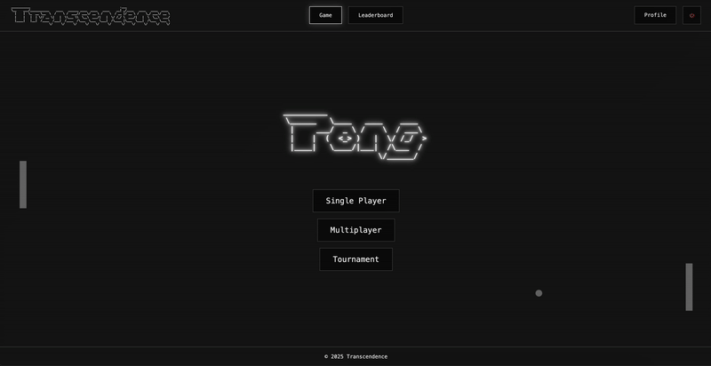

<h1 align="center">Transcendence</h1>

<div align="center" id="top"> 
  
  &#xa0;
</div>

<p align="center">
  <a href="#about-">About</a> &#xa0; | &#xa0; 
  <a href="#features-">Features</a> &#xa0; | &#xa0;
  <a href="#technologies-">Technologies</a> &#xa0; | &#xa0;
  <a href="#requirements-">Requirements</a> &#xa0; | &#xa0;
  <a href="#starting-">Starting</a> &#xa0; | &#xa0;
  <a href="#license-">License</a> &#xa0; | &#xa0;
  <a href="https://projects.intra.42.fr/ft_transcendence/bboissen" target="_blank">Authors</a>
</p>

<br>

# About 🎯

### Backend
The transcendence backend is built on a robust microservices architecture, with dedicated services for authentication, user profiles, friend management, game logic, and a central gateway. Each microservice operates independently with its own database and business logic, communicating through well-defined APIs. The auth service handles user authentication with secure JWT token management, while the profile service maintains user information and statistics. The friends service manages social connections between users, and the game service orchestrates match creation, gameplay state, and tournament functionality. This distributed architecture ensures scalability, resilience, and maintainable code through clear separation of concerns.

### Devops
The project implements a sophisticated monitoring infrastructure using OpenTelemetry, Prometheus, and Grafana. Custom instrumentation throughout the microservices collects detailed metrics on service performance, resource utilization, and user interactions. The monitoring system tracks API response times, database query performance, WebSocket connections, and game statistics. Prometheus scrapes these metrics at regular intervals, while Grafana provides customizable dashboards for real-time visualization of application health and user engagement. This observability stack enables proactive identification of performance bottlenecks and facilitates data-driven improvements to the gaming experience.

### Website
The frontend features a native TypeScript implementation that mimics React's component architecture without any dependencies on the React library itself. This custom framework provides component lifecycle management, state handling, and a virtual DOM-like rendering system. The application employs a custom Router for client-side navigation, a NotificationManager for user alerts, and a WebSocketClient for real-time updates. Core UI components are structured hierarchically with proper encapsulation and reusability. This approach demonstrates deep understanding of modern frontend architecture while maintaining complete control over the rendering pipeline and application performance.

### Pong
The Pong game engine showcases sophisticated physics simulation with continuous collision detection using sweep AABB (Axis-Aligned Bounding Box) algorithms. This ensures accurate collision handling even at high ball speeds. The system implements two distinct AI opponents: a background "no brain" AI that provides ambient gameplay demonstrations with simple ball tracking and center-seeking behavior, and an advanced single-player algorithmic AI capable of predicting up to 8 ball collisions. This predictive AI analyzes potential ball trajectories, calculating reflection angles and acceleration to position its paddle optimally. The prediction system refreshes every second, creating a challenging yet beatable opponent that adapts to increasing ball speeds and complex bounces throughout the match.

&#xa0;

# Features ✨

✅​ Native Typescript mock React SPA\
✅​ Pong game, single-multi player & round-robin tournaments\
✅​ Users system with profile, statistics, friends and settings

&#xa0;

# Technologies 🚀

The following language, tools and libraries were used in this project:

- [Docker](https://docs.docker.com/)
- [Node.js](https://nodejs.org/en/)
- [TypeScript](https://www.typescriptlang.org/)
- [Vite](https://vite.dev/)
- [SQLite](https://www.sqlite.org/)
- [Fastify](https://fastify.dev/)
- [Prometheus](https://prometheus.io/)
- [Grafana](https://grafana.com/)
- [OpenTelemetry](https://opentelemetry.io/)
- [Plotly](https://plotly.com/javascript/)

&#xa0;

# Requirements ☑️

Before starting, you need to have [Git](https://git-scm.com), [Docker](https://docs.docker.com/compose/) and [Node](https://nodejs.org/en/) installed.

&#xa0;

# Starting 🏁

```bash
# Clone this project
$ git clone https://github.com/talibabtou/transcendence

# Access
$ cd transcendence

# Setup .env.example to .env

# Run the Makefile to launch the project on a 42 school computer with local volume management
$ make
# Or run directly the docker compose command to let docker manage volume
$ docker compose up --build

# Website will initialize in the <https://localhost:8048>
# Swagger will initialize in the <https://localhost:8085/documentation>
# Grafana will initialize in the <https://localhost:8081>
```

&#xa0;

# License 📝 

This project is under license from MIT. For more details, see the [LICENSE](LICENSE.md) file.


Made with ❤️​ by <a href="https://github.com/talibabtou" target="_blank">gdumas, <a href="https://github.com/Bboissen" target="_blank">bboissen & <a href="https://github.com/jasonmgl" target="_blank">jmougel</a>

&#xa0;

<a href="#top">Back to top</a>